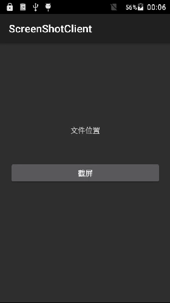

# ScreenShotSampleServer
Android 仿5.0系统截屏服务端

# 客户端地址https://github.com/OldDriver007/ScreenShotSampleClient

# 博客地址http://blog.csdn.net/wds1181977/article/details/51957034

###编译mk文件 编译到系统，然后安装客服端apk 实现截屏

```
LOCAL_PATH:= $(call my-dir)
include $(CLEAR_VARS)

LOCAL_MODULE_TAGS := optional

LOCAL_SRC_FILES := $(call all-java-files-under,src) \
					src/com/example/screenshotsample/IScreenshotControl.aidl

LOCAL_PACKAGE_NAME := ScreenShotSampleServer

LOCAL_CERTIFICATE := platform

include $(BUILD_PACKAGE)
```
### Screenshots





### License


```
Copyright 2016 Google, Inc.
